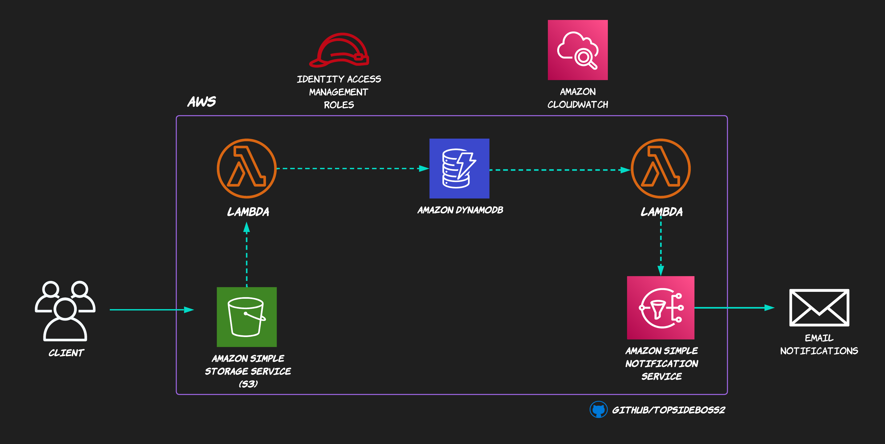

# AWS SERVERLESS INVENTORY ALERTS PROJECT

**Source:**
- https://kevinkiruri.medium.com/serverless-architecture-on-aws-be3d6bd13f9a

## Introduction

This AWS Serverless Inventory Project is an implementation of [Kevin Kiruri's](https://kevinkiruri.medium.com) [Serverless Architecture Blog Post](https://kevinkiruri.medium.com/serverless-architecture-on-aws-be3d6bd13f9a). 

In a bid to learn more about the AWS CLI, I implemented the project strictly through the cli. It was an amazing learning curve where I was able to read lots of documentation that AWS offers. 

I just want to appreciate AWS for having a simple and comprehensive documentation that one can follow through and learn.

For those who would like to try out. I created a script that has all the commands I used. Just substitute the variables (i.e <dynamodb-table-name>) with the respective names. 

Blog post coming soon!